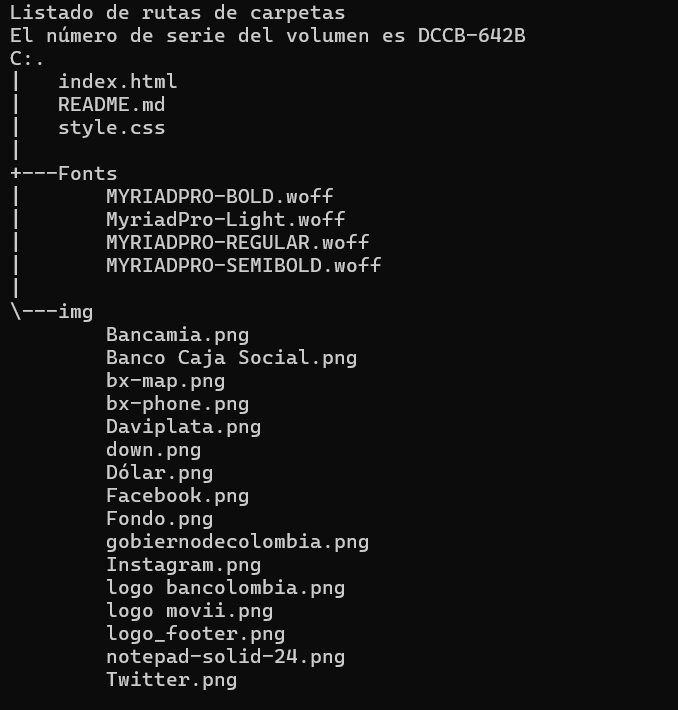

# Ingreso Solidario

Página gubernamental de subsidios económicos.

# Índice

1. Estado del Proyecto
2. [Descripción del Proyecto](#id2)
3. Tecnologías Utilizadas
4. Estructura del proyecto
5. Características
6. Diseño
7. Instrucciones
5. Personas Desarrolladoras del Proyecto

# Estado del proyecto

Finalizado

# Descripción del Proyecto

En este sitio, puede encontrar información sobre quién es elegible para estos subsidios y cómo puede solicitarlos. Nuestro objetivo es hacer que este material sea accesible y proporcionar la información más actualizada disponible para aquellos que la necesiten, además de información actualizada sobre cualquier cambio en el sistema de subsidios. En resumen, este sitio web debe servir como un recurso completo para alguien que requiera de ayuda financiera como resultado de la pandemia COVID-19.

# Tecnologías utilizadas

* HTML5
* CSS
* Tipografía: MyriadPro (light, regular, semibold y bold)

# Estructura del proyecto

# Características

Archivos Fundamentales:

**index.html**: Este archivo es el corazón de la página web. Contiene el contenido principal que se muestra a los visitantes.

**style.css**: Aquí se definen los estilos visuales para que la página luzca atractiva y coherente.

**Recursos Gráficos**: La carpeta img almacena las imágenes de los productos. Estas imágenes se utilizan para mostrar los pantalones, camisas, abrigos y otros artículos en la página.

**Fuentes Tipográficas**: La carpeta fonts contiene archivos de fuentes utilizados para dar estilo al texto en la página.

# Diseño

* El diseño es responsive, se adapta a todo tipo de pantallas. Cuenta con media querys para darle un estilo que se adapte a ciertos dispositivos

* En su mayoría, el posicionamiento es absoluto.

# Instrucciones

1. Clonar el repositorio
~~~
https://github.com/JesusBustamante/Filtro_HTML_BustamanteJesus.git
~~~

2. Abre el archivo index.html en tu navegador web.

# Personas Desarrolladoras del Proyecto

Este proyecto fue desarrollado por Jesús Leonardo Bustamante Ramírez, estudiante de Campuslands como parte de los proyectos requeridos para el módulo de HTML y CSS.
